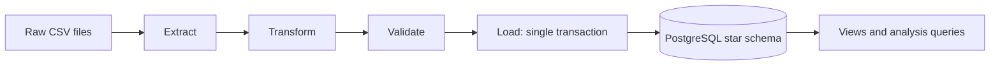
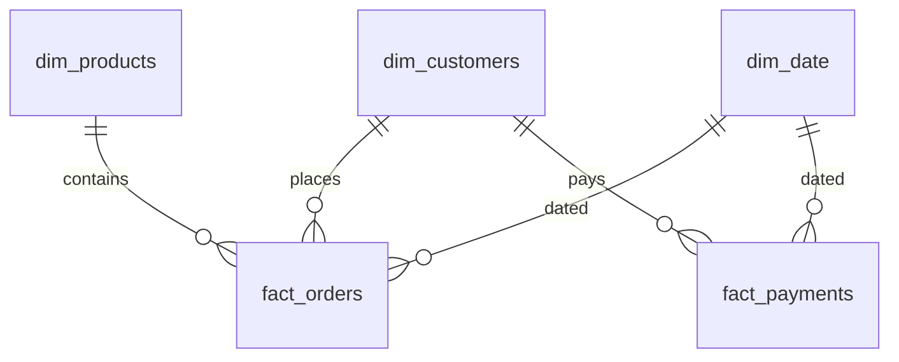

# E-commerce Data Pipeline

A batch ETL pipeline that converts six raw Olist CSV files into a validated PostgreSQL star schema and answers sales questions with SQL.

`Python` · `pandas` · `PostgreSQL` · `psycopg 3` · `SQL` · `unittest`

---

## Overview

The Olist dataset is split across related files that are not directly joinable. Orders, order line items, and payments each sit at a different grain, and the raw files contain unusable rows plus orders that are outside the scope of a sales warehouse. Loading them as-is would produce broken references and inflated payment totals.

The pipeline processes the data in four stages, then loads a small warehouse and exposes it for analysis. Order items and payments are stored as two separate facts, so a multi-item order never multiplies its payment amount. The deliverable is a queryable schema with three reusable views and nine analysis queries.

This is a manual batch job. It does not include scheduling, streaming, an API, or any cloud service.

## Architecture




## Pipeline Stages

| Stage | Module | Responsibility |
| --- | --- | --- |
| Extract | `src/extract.py` | Verify the six files and their required columns exist, then read all fields as strings |
| Transform | `src/transform.py` | Remove exact duplicates, normalize text, parse dates and numbers, translate categories, keep delivered orders |
| Validate | `src/validate.py` | Enforce key uniqueness, parent references, numeric ranges, and item-total consistency |
| Load | `src/load.py` | Insert dimensions and facts in one transaction, then create the views |
| Analyze | `sql/` | Three views and nine queries for sales reporting |

`src/pipeline.py` runs the stages in order and writes execution details to `logs/pipeline.log`.

## Data Validation

Every rule below is enforced in code before a row reaches PostgreSQL.

| Rule | Behavior |
| --- | --- |
| File and column contract | Stops with the missing file or column name |
| Exact duplicate rows | Dropped during transformation |
| Duplicate business keys | Stop validation instead of silently selecting one row |
| Identifier format | IDs must be 32-character hexadecimal strings |
| Date validity | Unparseable or out-of-range purchase dates are rejected |
| Integer range | Sequence values must fit PostgreSQL `INTEGER` and be whole numbers |
| Amount range | Amounts must be finite, non-negative, and within the numeric column bounds |
| Item arithmetic | `total_amount` must equal `quantity * unit_price` |
| Referential integrity | Facts must reference existing dimension keys |
| Order status scope | Non-delivered orders and their children are excluded, not rejected |
| Count reconciliation | Each source reports `input = duplicates + rejected + excluded + cleaned` |

A deliberate distinction is kept between **rejected** rows (data quality) and **excluded** rows (business scope). Counts are logged immediately after transformation, so they survive a later database failure.

## Data Model

A small star schema: `fact_orders` joins to all three dimensions, and `fact_payments` joins to customer and date.



| Table | Grain | Key |
| --- | --- | --- |
| `dim_customers` | One source customer ID | Surrogate `customer_key`; unique `customer_id` |
| `dim_products` | One product ID | Surrogate `product_key`; unique `product_id` |
| `dim_date` | One purchase date observed in delivered orders | `date_key` as `YYYYMMDD` |
| `fact_orders` | One order item | `(order_id, order_item_id)` |
| `fact_payments` | One payment record | `(order_id, payment_sequential)` |


`dim_customers` retains `customer_unique_id`, which identifies a person across multiple order-specific customer IDs. One item row equals one unit, so `quantity` is always 1 and the item amount equals its price. Item revenue excludes freight; payment amounts are a separate measure and can include it. The two facts should not be joined directly on `order_id` for money totals — aggregate each to order grain first.

## SQL Analysis

`sql/analytics_queries.sql` answers:

- Total item revenue from delivered orders.
- Order count and average item value per order.
- Month-by-month sales trend.
- Top products and categories by units and revenue.
- Highest-value customers and repeat customers.
- Payment totals by type.

The backing views are `monthly_sales_summary`, `customer_order_summary`, and `product_sales_summary`. Customer-level queries group on `customer_unique_id` so a repeat buyer is not counted as several people.

## Testing

The suite uses the standard library, so no extra test dependency is required.

```bash
python -m unittest discover -s tests -v
```

- 16 extraction, transform, and validation tests run standalone on synthetic rows.
- 4 PostgreSQL integration tests are skipped unless `TEST_DATABASE_URL` points to a disposable database.

```bash
createdb ecommerce_pipeline_test
TEST_DATABASE_URL='dbname=ecommerce_pipeline_test' \
  python -m unittest discover -s tests -v
```

Result: **20 tests pass**. The integration tests create a uniquely named schema per test, drop it afterward, and cover first and repeated loads, new keys, unchanged existing values, empty facts, the views and queries, and rollback after a constraint violation.

## Project Structure

```text
ecommerce-data-pipeline/
├── src/
│   ├── extract.py            # CSV loading and required-column checks
│   ├── transform.py          # Cleaning rules and per-source counts
│   ├── validate.py           # Key, reference, and numeric checks
│   ├── load.py               # Transactional inserts
│   ├── pipeline.py           # Entry point and logging
│   └── make_images.py        # Database-backed charts and diagrams
├── sql/
│   ├── create_tables.sql     # Tables, constraints, indexes
│   ├── views.sql             # Three analytical views
│   └── analytics_queries.sql # Nine queries
├── tests/
│   ├── sample_data.py        # Synthetic source rows
│   ├── test_pipeline.py      # Extraction, transform, validation
│   └── test_load.py          # PostgreSQL integration
├── docs/
│   └── run_results.md        # Verified full-data results
├── data/raw/                 # Downloaded CSVs (ignored)
├── images/                   # Architecture diagram
├── portfolio/                # Project visuals
├── logs/                     # Run logs (ignored)
├── requirements.txt
└── README.md
```

## Running the Pipeline

Requires Python and a running PostgreSQL server with the `createdb` and `psql` clients. The pipeline was verified on Linux with Python 3.14.7 and PostgreSQL 18.6. Use a dedicated database owned by a role that can create tables and views.

**1. Install dependencies**

```bash
git clone https://github.com/abosameh522/ecommerce-data-pipeline.git
cd ecommerce-data-pipeline
python -m venv .venv
source .venv/bin/activate          # Windows: .venv\Scripts\activate
python -m pip install -r requirements.txt
```

**2. Download the source files**

```bash
curl --fail --location --retry 2 \
  https://www.kaggle.com/api/v1/datasets/download/olistbr/brazilian-ecommerce \
  --output olist.zip
unzip -j olist.zip -d data/raw
```

The archive includes three files the pipeline does not read; they can stay in `data/raw/`. If the endpoint requires a login, download from Kaggle and extract manually.

**3. Configure the connection**

The pipeline reads `DB_HOST`, `DB_PORT`, `DB_NAME`, `DB_USER`, and optional `DB_PASSWORD`. It does not load `.env` on its own, so export the values into the shell.

```bash
cp .env.example .env
# Edit .env with your PostgreSQL settings, then:
set -a; source .env; set +a

# The psql/createdb tools use PG* variables, not DB*.
export PGHOST="$DB_HOST" PGPORT="$DB_PORT" PGUSER="$DB_USER"
export PGPASSWORD="${DB_PASSWORD:-}"
createdb "$DB_NAME"
```

**4. Run**

```bash
python src/pipeline.py
psql -X -v ON_ERROR_STOP=1 -d "$DB_NAME" -f sql/analytics_queries.sql
python src/pipeline.py        # second run: expect zero inserts
python src/make_images.py     # regenerate visuals from the loaded database
```

Tables and views are created automatically. A second run should log zero inserts for every table.

## Outputs

| Output | Location |
| --- | --- |
| Five warehouse tables | `dim_customers`, `dim_products`, `dim_date`, `fact_orders`, `fact_payments` |
| Three views | `monthly_sales_summary`, `customer_order_summary`, `product_sales_summary` |
| Run log | `logs/pipeline.log` |
| Sales chart and diagrams | `images/`, `portfolio/` |
| Verified run numbers | `docs/run_results.md` |

On the full archive the pipeline loads 96,478 delivered orders, 110,197 order items, and 100,756 payment records, with a second run inserting nothing. Item revenue is BRL 13,221,498.11 and the average item value per order is BRL 137.04; `health_beauty` leads categories at BRL 1,233,131.72.


The monthly chart covers this historical sample only. Months without delivered orders are absent rather than zero-filled, and partial months are not complete trading periods.

## Technical Decisions

- **Separate fact grains.** Items and payments are loaded independently so payment totals stay correct when an order has several items.
- **Insert-only loading.** `INSERT ... ON CONFLICT DO NOTHING` makes reruns safe by skipping known keys instead of overwriting data.
- **Business keys plus constraints.** Each dimension has a natural unique key, and facts have composite primary keys backed by foreign keys and indexes.
- **Validation before load.** Range and consistency checks run in Python so failures are explicit instead of surfacing as database errors mid-transaction.
- **Reconciled quality counts.** Distinguishing rejected from excluded rows keeps the delivered-order filter independent from genuine data errors.
- **Integer date key.** `dim_date` uses a `YYYYMMDD` integer key, which keeps joins simple.

## Limitations

- The load only inserts. Source corrections, changed prices, or deleted records are not reflected on a rerun.
- `dim_date` contains observed dates, not a continuous calendar, so empty months are missing from trend queries.
- Risk of double counting is documented but not prevented: joining both facts on `order_id` before aggregation inflates results.
- Insert counts come from before/after table counts and assume a single writer.
- The pipeline holds the data in memory and runs on demand; there is no scheduler or incremental watermark.
- No code license is currently included in the repository.

## Future Improvements

- Add an explicit upsert path with an update timestamp so corrected source rows propagate.
- Emit a rejected-rows report with a reason per record.
- Reconcile source and warehouse for delivered orders missing items or payments.
- Build a continuous date dimension for gap-free monthly reporting.
- Add orchestration once recurring runs are needed.

## Data Source

[Brazilian E-Commerce Public Dataset by Olist](https://www.kaggle.com/datasets/olistbr/brazilian-ecommerce), licensed [CC BY-NC-SA 4.0](https://creativecommons.org/licenses/by-nc-sa/4.0/). The data are anonymized orders from 2016–2018. Raw files are downloaded separately and are not committed.

## Author

[Ahmed Sameh](https://github.com/abosameh522)
