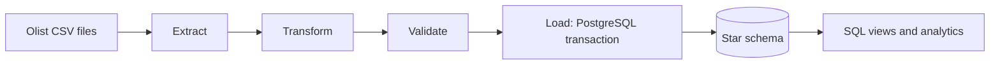
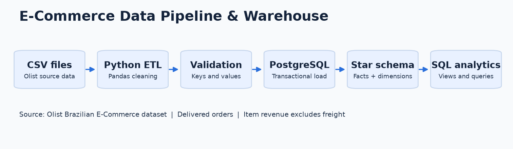
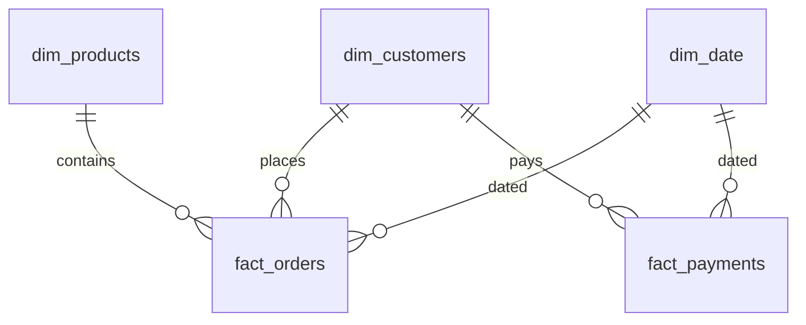
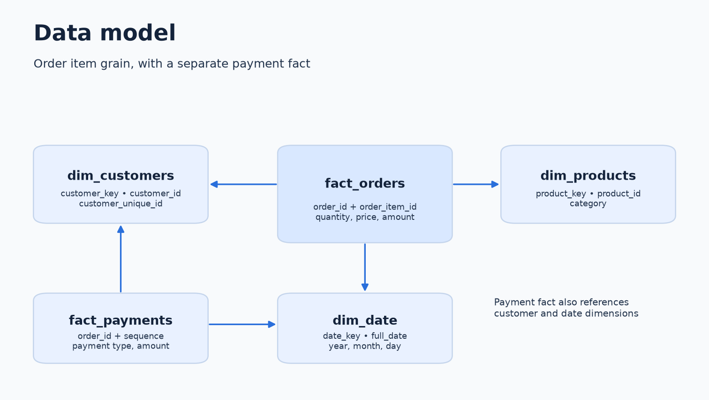
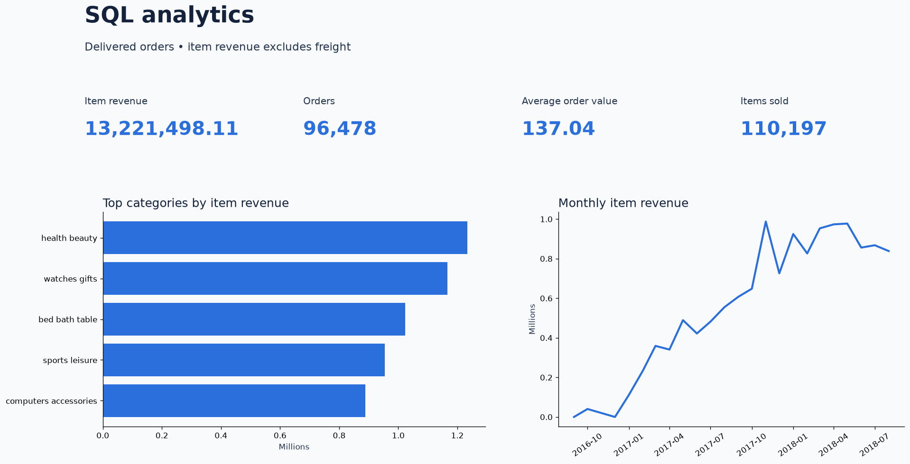

# E-Commerce Data Pipeline & Warehouse

A Python and PostgreSQL ETL pipeline that cleans and validates six Olist e-commerce CSV files and loads a small star-schema warehouse for SQL analysis.

The full-data run loaded **110,197 order items** and **100,756 payment records** for delivered orders, and the analytical views report **BRL 13,221,498.11** in item revenue.

## Overview

The Olist export is a set of related CSV files rather than one clean table. Orders, order items, and payments arrive at different grains, with invalid identifiers, blank category names, and non-delivered orders mixed in.

This project turns those files into a queryable warehouse:

- Reads the six needed CSVs and checks their columns.
- Cleans and normalizes text, dates, and numeric fields.
- Validates keys, references, and monetary ranges before loading.
- Loads dimensions and facts into PostgreSQL in one transaction.
- Exposes three views and nine analytical queries for sales reporting.

The warehouse keeps order items and payments in separate fact tables, so a multi-item order does not multiply its payment totals. It is a batch pipeline with an insert-only load, not a scheduled or streaming system.

## Architecture





## Pipeline Flow

| Stage | What it does | Where |
| --- | --- | --- |
| Extract | Confirms the six files and required columns exist, then reads identifiers as strings | `src/extract.py` |
| Transform | Removes exact duplicates, normalizes text, parses dates and numbers, translates categories, keeps delivered orders | `src/transform.py` |
| Validate | Checks key uniqueness, parent references, integer ranges, finite amounts, and item-total consistency | `src/validate.py` |
| Load | Inserts dimensions and facts in one transaction, then creates views | `src/load.py` |
| Analyze | Monthly, customer, product, and payment queries | `sql/` |

`src/pipeline.py` wires the stages together and writes run logs to `logs/pipeline.log`.

## Tech Stack

| Layer | Tools |
| --- | --- |
| Language | Python 3 |
| Data handling | pandas |
| Database | PostgreSQL |
| Driver | psycopg 3 |
| Querying | SQL (views, joins, aggregates, CTE) |
| Visuals | Matplotlib |
| Tests | Python `unittest` |

Matplotlib is used only to generate the diagrams and the sales chart. It is not part of the ETL path.

## Data Model

The warehouse is a small star schema. `fact_orders` joins to all three dimensions; `fact_payments` joins to customer and date.



| Table | Grain | Key |
| --- | --- | --- |
| `dim_customers` | One source customer ID | Surrogate `customer_key`; unique `customer_id` |
| `dim_products` | One product ID | Surrogate `product_key`; unique `product_id` |
| `dim_date` | One purchase date present in delivered orders | `date_key` in YYYYMMDD form |
| `fact_orders` | One order item | `(order_id, order_item_id)` |
| `fact_payments` | One payment record | `(order_id, payment_sequential)` |



`dim_customers` keeps `customer_unique_id` so repeat customers can be counted across different source customer IDs. An item row represents one unit, so `quantity = 1` and its amount equals its price. Revenue is the sum of item amounts in BRL, excluding freight; payment amounts are a separate measure.

## Project Structure

```text
ecommerce-data-pipeline/
├── src/
│   ├── extract.py            # CSV loading and required-column checks
│   ├── transform.py          # Cleaning rules and per-source row counts
│   ├── validate.py           # Key, reference, and numeric checks
│   ├── load.py               # Transactional dimension and fact inserts
│   ├── pipeline.py           # Entry point and logging
│   └── make_images.py        # Database-backed charts and diagrams
├── sql/
│   ├── create_tables.sql     # Five tables, constraints, indexes
│   ├── views.sql             # Three analytical views
│   └── analytics_queries.sql # Nine analysis queries
├── tests/
│   ├── sample_data.py        # Synthetic source rows
│   ├── test_pipeline.py      # 16 extraction/transform/validation tests
│   └── test_load.py          # 4 PostgreSQL integration tests
├── docs/
│   └── run_results.md        # Verified full-data results
├── data/raw/                 # Downloaded CSVs (ignored by Git)
├── images/                   # Architecture diagram
├── portfolio/                # Project visuals
├── logs/                     # Run logs (ignored by Git)
├── requirements.txt
└── README.md
```

## Data Quality Checks

Cleaning and validation run before any row reaches the database.

| Check | Behavior |
| --- | --- |
| Source files and columns | Missing files or columns stop the run with the file and column names |
| Exact duplicates | Removed before validation |
| Duplicate business keys | Stop validation instead of silently keeping one row |
| Invalid identifiers | IDs must be 32-character hex values |
| Dates | Invalid or out-of-range purchase dates are rejected |
| Numeric ranges | Positive integers must fit PostgreSQL `INTEGER`; amounts must be finite, non-negative, and fit the numeric columns |
| Item totals | `total_amount` must equal `quantity * unit_price` |
| References | Facts must reference existing dimensions |
| Delivered-order rule | Non-delivered orders and their items/payments are excluded, not rejected |
| Reconciled counts | Every source reports `input = duplicates + rejected + excluded + cleaned` |

Counts are logged right after transformation, so they remain available even if the database load fails.

## SQL Analysis

`sql/analytics_queries.sql` answers questions such as:

- How much item revenue did delivered orders generate?
- What is the average item value per order?
- How did monthly sales change over the period?
- Which products and categories sell the most?
- Which customers place the most orders and repeat?
- How are payments split across types?

Three reusable views back these queries: `monthly_sales_summary`, `customer_order_summary`, and `product_sales_summary`. Customer rankings use `customer_unique_id` rather than treating each order-specific customer ID as a different person.

## Testing

Tests use synthetic source rows, so the Kaggle download is not required:

```bash
python -m unittest discover -s tests -v
```

This runs **16 extraction, transform, and validation tests**. Four PostgreSQL integration tests are skipped unless `TEST_DATABASE_URL` is set:

```bash
createdb ecommerce_pipeline_test
TEST_DATABASE_URL='dbname=ecommerce_pipeline_test' \
  python -m unittest discover -s tests -v
```

Result: **20 tests passed**. The integration tests create an isolated schema per test and remove it afterward. They cover first and repeated loads, new-key inserts, unchanged existing values, empty facts, the SQL views and queries, and transaction rollback after a constraint failure.

## Results

Verified on the full Olist archive with Python 3.14.7 and PostgreSQL 18.6. Details are in [docs/run_results.md](docs/run_results.md).

| Metric | Value |
| --- | ---: |
| Source rows read | 99,441 customers, 112,650 items, 103,886 payments |
| Delivered orders with loaded items | 96,478 |
| Order items loaded | 110,197 |
| Payment records loaded | 100,756 |
| Item revenue, excluding freight | BRL 13,221,498.11 |
| Average item value per order | BRL 137.04 |
| Highest-revenue category | `health_beauty`, BRL 1,233,131.72 |

A second run inserted **zero** rows in every table, confirming that repeated loads skip existing keys.



The monthly chart reflects this historical sample, not the full market; months with no delivered orders are not filled in, and partial months should not be read as complete trading periods.

## How to Run

You need Python and a running PostgreSQL server, including the `createdb` and `psql` clients. Use a dedicated database and a role allowed to create tables and views.

**1. Install dependencies**

```bash
git clone https://github.com/abosameh522/ecommerce-data-pipeline.git
cd ecommerce-data-pipeline
python -m venv .venv
source .venv/bin/activate
python -m pip install -r requirements.txt
```

**2. Download the CSVs**

```bash
curl --fail --location --retry 2 \
  https://www.kaggle.com/api/v1/datasets/download/olistbr/brazilian-ecommerce \
  --output olist.zip
unzip -j olist.zip -d data/raw
```

The archive also contains three unused CSVs; they can stay in `data/raw/`. If the endpoint asks for a login, download from Kaggle manually.

**3. Configure the database**

The pipeline reads `DB_HOST`, `DB_PORT`, `DB_NAME`, `DB_USER`, and optional `DB_PASSWORD`. It does **not** load `.env` automatically.

```bash
cp .env.example .env
# Edit .env with your PostgreSQL settings, then:
set -a; source .env; set +a

# PostgreSQL CLI tools use PG* variables, not the pipeline's DB* variables.
export PGHOST="$DB_HOST" PGPORT="$DB_PORT" PGUSER="$DB_USER"
export PGPASSWORD="${DB_PASSWORD:-}"
createdb "$DB_NAME"
```

**4. Run the pipeline and the SQL**

```bash
python src/pipeline.py
psql -X -v ON_ERROR_STOP=1 -d "$DB_NAME" -f sql/analytics_queries.sql
python src/pipeline.py        # second run: expect zero inserts
python src/make_images.py     # regenerate the visuals (needs loaded data)
```

Tables and views are created automatically. Logs go to `logs/pipeline.log`.

## Lessons Learned

- Item and payment facts need different grains. Keeping them separate is what keeps payment totals accurate.
- Business keys plus unique constraints make repeat loads safe, but they only skip duplicates; they do not update changed rows.
- Separating *rejected* data-quality failures from *excluded* order statuses makes the quality counts easier to trust.
- Validating ranges before loading catches values that would otherwise fail late inside PostgreSQL.

## Future Improvements

These are not implemented yet:

- A defined update policy for corrected source records (upsert instead of insert-only).
- A rejected-row report with reasons for each rejected record.
- Source-to-warehouse reconciliation for delivered orders missing items or payments.
- A continuous date calendar so monthly trends cover empty months.
- Optional orchestration (for example, a scheduler or Airflow DAG) once the manual run is not enough.

## Data Source

[Brazilian E-Commerce Public Dataset by Olist](https://www.kaggle.com/datasets/olistbr/brazilian-ecommerce), licensed [CC BY-NC-SA 4.0](https://creativecommons.org/licenses/by-nc-sa/4.0/). Anonymized orders from 2016–2018. Raw files are downloaded separately and ignored by Git.

## Author

[Ahmed Sameh](https://github.com/abosameh522)
